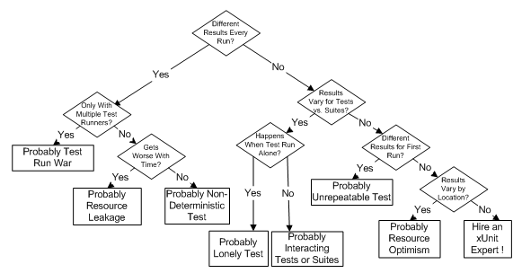

# Software Testing MOOC

This repository contains the code examples and exercises of
TU Delft's edX MOOC on Software Testing.

## License

This repository is licensed under CC BY-NC-SA.

## Course

- Test analysis and design
- Test execution

### Error, Fault, and Failure

- Failure: A component or system behaves in a way that it is not expected
- Defect or bug or fault: A flaw in a component that can cause the system to behave incorrectly. A defect, if encountered during execution, may cause a failure
- Error: A human action that produces an incorrect result

### Validation vs verification

- Validation: is more about making sure that our system delivers what the user needs it to deliver. are we building the system that our users really want?
- Verification: is more focused on, are we building the system, right?. with verification, we make sure that our system delivers what the specification wants it to deliver, that it is free of bugs.

### When is code tested enough?

"Testing can show the presence of defects, but testing does not actually show their absence."

### Am I less productive if I write automated tests?

Some might say: "I write 100 lines of production code a day... Now, if I have to write automated tests, I will write 50 lines of production code a day and 50 lines of test code a day... So, I'm less productive now!"

## Partitions and Equivalence Partitioning

### Category-Partition method

- Identificar parametros
- Caracteristicas de cada parametro
- Add constraints
- Generar combinaciones

## Structural testing and code coverage

you probably feel that, although we have 100% line coverage, our tests are not enough.

In practice, there is no single technique that gives us 100% confidence that our systems are tested enough.

That's why we should combine all the different techniques we learned so far and test as much as we can!

### : Branch and condition coverage

A better criteria here would be to make sure we have at least one test for each branch or for each arrow in the graph.

### Condition Coverage

Condition coverage seems to cover more cases than branch coverage...
or line coverage, for that matter!

### Path coverage

Path coverage means that we want to really test all the possible paths and combinations

### Modified Condition / Decision Coverage

## Testability and Mock Objects

### Unit and System testing

Unit tests search for defects in and verifies the functioning of software items. For example, modules, programs, objects, classes, etc., that are separately testable.

### Integration testing

Unit tests, meaning we were testing one unit isolated from the rest, and the other extreme was system test, or black box test,

Cuando una clase interactua con una base de datos y queremos testear esto.. eso seria una prueba de integracion

ISQTB: defines Integration tests when you test interfaces between components, interactions to different parts of a system such as OS, file system, hardware, or interface between systems.

### Testing pyramid

However, one thing that we see in practice is people doing what we call the ice cream cone test, which is the testing pyramid, but the other way around.
They do just a small number of unit tests, they do a lot of system tests and they do a lot of manual tests.
You should avoid doing this ice cream cone way of testing.
You should focus more on the testing pyramid.

### Hard-to-test dependencies

### Mock objects

This simulation in software testing, we call it a mock object. So when we say, we're gonna mock some object, we're saying we're gonna create a simulation of a specific class, just for the sake of testability

#### Controllability and Observability

In other words, controllability is about how easy it is for us to provide inputs and invoke the behaviour that we want in the system under test. Observability is about how easy it is for us to observe the system under test in order to verify whether the system behaved as expected.

### Design for testability

#### Principles of Testable Architectures

#### Dependency Injection

## Test code smells

Existen patrones para hacer tests unitarios

### FIRST properties of good tests

- FAST: should be fast
- Isolated: we want our test to test an isolated piece of functionality, and good unit tests usually focus on a small chunks of code.
- Repeatable: We don't want tests that pass sometimes and fail some other times.
- Self-validating:
- Timely: You need to make sure that automated testing becomes a habit.

### Code smells

- Duplicated code
- Assetion roulette
- Slow tests
- Resource optimism
- Test run war
- General fixture
- Indirect tests
- Sensitive equality

### Flaky tests

Sometimes it passes, sometimes it fails...? We call them flaky tests.

Reasons:

- you have a test that depends on an external infrastructure, like a database or a web service.
- developers are sharing resources, some other person changes the database, and this affects your tests.
- you have time-outs, Your test is waiting for something to happen in the web application, The web application, for some reason, gets one second slower, and then your test fails because of that.
- you have interacting tests. So, test one, for some reason, interacts with test two, and vice-versa.

### Test readability

- Arrange
- Act
- Assert

No tener valores magicos, sino mas bien tenerlos en variables con nombres entendibles

### Flakiness decision table

###
